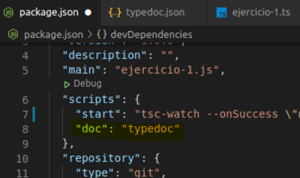
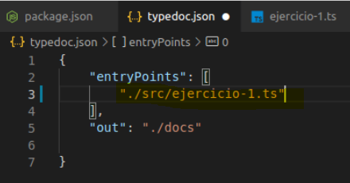
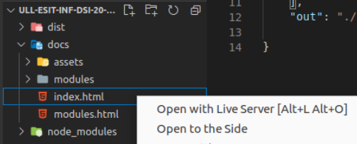
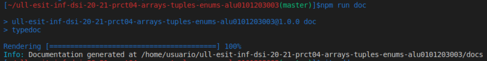
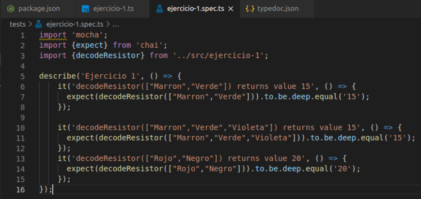
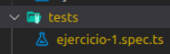
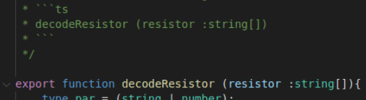
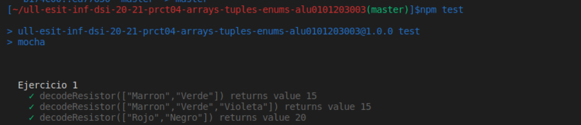
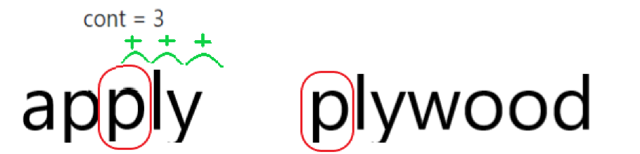
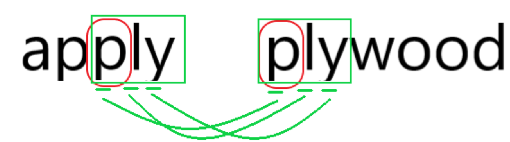

# Práctica 4: Arrays, tuplas y enumerados. Informe.
## Desarrollo de Sistemas Informáticos 
## Raúl Martín Rigor - alu0101203003@ull.edu.es

### Introducción

En este informe se resumen las actividades realizadas en la **práctica 4** para poner en práctica nuestros conocimientos de TypeScript sobre tipos de datos que son utilizados para agrupar elementos (arrays, tuplas y enumerados) a través de la implementación de distintas funciones en una serie de ejercicios.

### Objetivos

Al finalizar la práctica, habremos completado los siguientes objetivos:

* Realizar pruebas unitarias para nuestras funciones con las herramientas *Mocha* y *Chai*
* Documentar nuestro progreso con la herramienta *TypeDoc*
* Adquirir conocimientos sobre manejo, operacion y manipulación de arreglos de datos en TypeScript
* Saber comparar elementos entre distintos arreglos
* Manipular y modificar conjuntos de elementos.

### 1. Creación y configuración del driectorio del proyecto.

#### 1.1. Estructura inicial

Con el fin de preparar una estructura adecuada para realizar para nuestro proyecto seguiremos el mismo proceso llevado a cabo en la [práctica 3](https://github.com/ULL-ESIT-INF-DSI-2021/ull-esit-inf-dsi-20-21-prct03-static-types-functions-alu0101203003.git) para la creación de la estructura inicial.

En adición a lo anterior, instalaremos en nuestro proyecto otros servicios que nos serán de utilidad (que se explicarán en los siguientes puntos), por lo que la estructura quedará un poco diferente:

  


#### 1.2. Instalación y configuración de TypeDoc

Instalaremos el servicio de [TypeDoc](https://typedoc.org/ ) que nos ayudará a generar automáticamente la documentación de nuestro proyecto siguiendo los pasos del [tutorial disponible en el campus virtual](https://campusingenieriaytecnologia.ull.es/mod/url/view.php?id=288597).

Añadiremos la linea `"doc": "typedoc"` al package.json para poder usar la herramienta, especificaremos la rutas de los ejercicios que queremos documentar al ejecutar el comando `npm run doc`. Podremos ver la documentación generada gracias a la extensión [Live Server](https://marketplace.visualstudio.com/items?itemName=ritwickdey.LiveServer):

   

#### 1.3. Instalación y configuración de Mocha

De esta práctica en adelante usaremos la metodología TDD de desarrollo de pruebas unitarias, para lo que nos ayudaremos de las herramientas [Mocha]( https://mochajs.org/) y [Chai](https://www.chaijs.com/).

Los pasos que llevaremos a cabo para el desarrollo de estas pruebas serán:

* Crear la prueba unitaria para la función
* La prueba fallará porque la función no está implementada
* Implementaremos el código necesario para que funcione
* La prueba funcionará

Las pruebas se desarrollan en el directorio test y los funciones (etiquetadas con `export` para que puedan ser usadas en las espectativas) se encuentran, como de costumbre, en el directorio src, el cual aloja el código fuente.

Estas pruebas se ejecutan con el comando `npm test` que mostrará si se cumplen las espectativas especificadas o donde se encuentran los errores.

   

### 2. Ejercicios

Paso a explicar la resolución de cada ejercicio y a adjuntar su código y expectativa. Se mostrará una versión simplificada de los enunciados de los ejercicios (para verlos al completo con aclaraciones y pistas, consultar la [guía de la práctica](https://ull-esit-inf-dsi-2021.github.io/prct04-arrays-tuples-enums/)

#### 1.1 Ejercicio 1

**Enunciado:**
Si desea realizar algún proyecto usando una Raspberry Pi, probablemente necesitará usar resistencias. Para este ejercicio necesita conocer dos cosas sobre las resistencias:

   * Cada resistor o resistencia tiene un valor de resistencia en Ohmios asociado. Además, las resistencias son tan pequeñas que si se les imprimiera el valor en ellas, sería muy difícil de leer. Para resolver este problema, los fabricantes siguen un estándar de bandas codificadas de colores para indicar sus valores de resistencia. Cada banda tiene una posición y un valor numérico.

   * Las primeras dos bandas de una resistencia tienen un esquema de codificación muy simple: cada color se mapea a un único número. Por ejemplo, si una resistencia tiene impresa una banda marrón (valor 1) seguida de una banda verde (valor 5), el valor de la resistencia se traduciría al número 15.

El objetivo de este ejercicio es crear un programa que nos ayude a calcular el valor de una resistencia sin tener que memorizar los valores de las bandas. Para ello, cree una función decodeResistor que recibe como parámetros los nombres de los colores de una resistencia como entrada y devuelve un número de dos dígitos indicando el valor de la resistencia. La función deberá devover un número de dos dígitos incluso si recibe más de dos colores como parámetros.

Las bandas de colores están codificadas de la siguiente manera:

* Negro: 0
* Marrón: 1
* Rojo: 2
* Naranja: 3
* Amarillo: 4
* Verde: 5
* Azul: 6
* Violeta: 7
* Gris: 8
* Blanco: 9

De este modo, la combinación Marrón-Verde debería devolver 15 al igual que Marrón-Verde-Violeta ignorando el tercer color.

**Resolución:**

Para resolver este problema primero tomaremos registro de la codificación especificada. Crearemos un arreglo donde cada elemento es un par de datos que corresponde a un color y su código asociado.

La función recibe una resistencia de entrada en forma de array. Para cada color de la resistencia se recorre el arreglo de códigos para averiguar a que código corresponde. Tenedremos un contador (j) que nos ayudará a comprobar que no tenemos en cuenta más de 2 posiciones (`if (j>1`). Una vez se dé esta condición, se almacena en el resultado los códigos de cada color concatenados (el código resultado representa la resistencia).

```ts
/**
 * Decodificación Resistencias
 * @param resistor Array de colores
 * @returns Devuelve el código
 * ```ts
 * decodeResistor (resistor :string[])
 * ```
 */

export function decodeResistor (resistor :string[]){
    type par = (string | number);
    let codigosColor :par[][] = [["Negro",0],["Marron",1],["Rojo",2],["Naranja",3],["Amarillo",4],["Verde",5],["Azul",6],["Violeta",7],["Gris",8],["Blanco",9]]
    var code :string ="";
    var i :number = 0;
    var j :number = 0;
    while(i < codigosColor.length){
        if (codigosColor[i][0] == resistor[j]){
            var codigo = codigosColor[i][1].toString()
            code += codigo
            j++
            i = -1
            if (j>1){
                return code
            }
        }
        i++
    }
    return "Error: Color incorrecto"

}
```


#### 1.2 Ejercicio 2

**Enunciado:**

Dado un array que contiene exclusivamente cadenas de texto, comprobar que las palabras del array están encadenadas. Esto es, una o más letras del final de una cadena coinciden con el comienzo de la siguiente cadena del array.

Ejemplos de palabras encadenadas:

* “apply” and “plywood”

* “apple” and “each”

* “behemoth” and “mother”

Ejemplos de palabras no encadenadas:

* “apply” and “playground”

* “apple” and “peggy”

* “behemoth” and “mathematics

Para resolver este ejercicio, escriba una función meshArray que compruebe si las cadenas del array están encadenadas o no. La función recibirá como parámetro un array de cadenas de texto y devolverá:

*  “Error al encadenar” si las cadenas del array no están encadenadas.
*  Una cadena de texto que contenga las letras que encadenan las palabras del array. A priori no sabe cuantas letras encadenadas tendrán en común, pero al menos será una.


**Resolución:**

Seguiremos una metodología muy clara para esta función:

* Recorreremos el array de entrada
* En cada iteración cogeremos elementos de 2 en 2 (palabra1 y plabra 2) que representan la palabra actual y la siguiente a evaluar

Una vez tenemos las 2 palabras evaluaremos si están encadenadas con los siguientes pasos:

* Cogeremos la primera letra de la segunda palabra
* Contaremos en la primera palabra de alante hacia atrás hasta encontrar una letra que coincida con la letra anterior


* Habiendo tenido en cuenta todos los movimientos que tuvimos que hacer hacia atrás, recorreremos hacia alante en las 2 palabras comprobando que coincidan letra a letra (aprovecharemos este paso para concatenar el resultado final)


* Si alguna letra no coincide, lo consideraremos un error.

```ts
/**
 * Palabras encadenadas
 * @param palabras Array de palabras encadenadas
 * @returns Devuelve las letras que encadenan
 * ```ts
 * meshArray (palabras :string[])
 * ```
 */

export function meshArray (palabras :string[]){
    var resultado :string = "";
    for (var i :number = 0; i < palabras.length-1; i++){
        var palabra1 :string[] = palabras[i].split("");
        var palabra2 :string[] = palabras[i+1].split("");
        var j :number = palabra1.length-1;
        var cont :number = 0;
        while (j > -1){
            if (palabra1[j] == palabra2[0]){
                break;
            } else {
                j--;
                cont++;
            }
        }
        for (var k :number = 0; k <= cont; k ++){
            if (palabra1[j] != palabra2[k]){
                return "Error al encadenar"
            } else {
                resultado += palabra1[j];
            }
        j++
        }
    }
    return resultado
}

```

#### 1.3 Ejercicio 3

**Enunciado:**


**Resolución:**

```ts
```

#### 1.4 Ejercicio 4

**Enunciado:**


**Resolución:**

```ts
```


#### 1.5 Ejercicio 5

**Enunciado:**


**Resolución:**

```ts
```


#### 1.6 Ejercicio 6

**Enunciado:**


**Resolución:**

```ts
```


#### 1.7 Ejercicio 7

**Enunciado:**


**Resolución:**

```ts
```


#### 1.8 Ejercicio 8

**Enunciado:**


**Resolución:**

```ts
```

