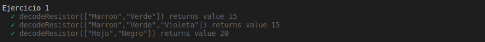
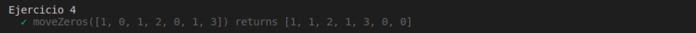
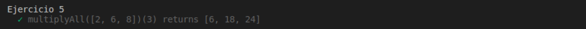
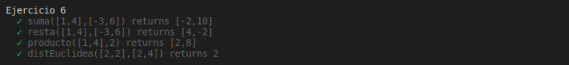
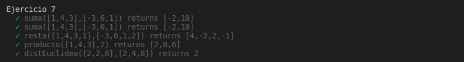
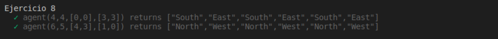

# Práctica 4: Arrays, tuplas y enumerados. Informe.
## Desarrollo de Sistemas Informáticos 
## Raúl Martín Rigor - alu0101203003@ull.edu.es

### Introducción

En este informe se resumen las actividades realizadas en la **práctica 4** para poner en práctica nuestros conocimientos de TypeScript sobre tipos de datos que son utilizados para agrupar elementos (arrays, tuplas y enumerados) a través de la implementación de distintas funciones en una serie de ejercicios.

### Objetivos

Al finalizar la práctica, habremos completado los siguientes objetivos:

* Realizar pruebas unitarias para nuestras funciones con las herramientas *Mocha* y *Chai*
* Documentar nuestro progreso con la herramienta *TypeDoc*
* Adquirir conocimientos sobre manejo, operacion y manipulación de arreglos de datos en TypeScript
* Saber comparar elementos entre distintos arreglos
* Manipular y modificar conjuntos de elementos.

### 1. Creación y configuración del driectorio del proyecto.

#### 1.1. Estructura inicial

Con el fin de preparar una estructura adecuada para realizar para nuestro proyecto seguiremos el mismo proceso llevado a cabo en la [práctica 3](https://github.com/ULL-ESIT-INF-DSI-2021/ull-esit-inf-dsi-20-21-prct03-static-types-functions-alu0101203003.git) para la creación de la estructura inicial.

En adición a lo anterior, instalaremos en nuestro proyecto otros servicios que nos serán de utilidad (que se explicarán en los siguientes puntos), por lo que la estructura quedará un poco diferente:

  


#### 1.2. Instalación y configuración de TypeDoc

Instalaremos el servicio de [TypeDoc](https://typedoc.org/ ) que nos ayudará a generar automáticamente la documentación de nuestro proyecto siguiendo los pasos del [tutorial disponible en el campus virtual](https://campusingenieriaytecnologia.ull.es/mod/url/view.php?id=288597).

Añadiremos la linea `"doc": "typedoc"` al package.json para poder usar la herramienta, especificaremos la rutas de los ejercicios que queremos documentar al ejecutar el comando `npm run doc`. Podremos ver la documentación generada gracias a la extensión [Live Server](https://marketplace.visualstudio.com/items?itemName=ritwickdey.LiveServer):

   

#### 1.3. Instalación y configuración de Mocha

De esta práctica en adelante usaremos la metodología TDD de desarrollo de pruebas unitarias, para lo que nos ayudaremos de las herramientas [Mocha]( https://mochajs.org/) y [Chai](https://www.chaijs.com/). También serán instalados usando la [guía proporcionada](https://campusingenieriaytecnologia.ull.es/mod/url/view.php?id=288629) en forma de video en el campus virtual.

Los pasos que llevaremos a cabo para el desarrollo de estas pruebas serán:

* Crear la prueba unitaria para la función
* La prueba fallará porque la función no está implementada
* Implementaremos el código necesario para que funcione
* La prueba funcionará

Las pruebas se desarrollan en el directorio test y los funciones (etiquetadas con `export` para que puedan ser usadas en las espectativas) se encuentran, como de costumbre, en el directorio src, el cual aloja el código fuente.

Estas pruebas se ejecutan con el comando `npm test` que mostrará si se cumplen las espectativas especificadas o donde se encuentran los errores.

   

### 2. Ejercicios

Paso a explicar la resolución de cada ejercicio y a adjuntar su código y expectativa. Se mostrará una versión simplificada de los enunciados de los ejercicios (para verlos al completo con aclaraciones y pistas, consultar la [guía de la práctica](https://ull-esit-inf-dsi-2021.github.io/prct04-arrays-tuples-enums/)

#### 1.1 Ejercicio 1

**Enunciado:**
Si desea realizar algún proyecto usando una Raspberry Pi, probablemente necesitará usar resistencias. Para este ejercicio necesita conocer dos cosas sobre las resistencias:

   * Cada resistor o resistencia tiene un valor de resistencia en Ohmios asociado. Además, las resistencias son tan pequeñas que si se les imprimiera el valor en ellas, sería muy difícil de leer. Para resolver este problema, los fabricantes siguen un estándar de bandas codificadas de colores para indicar sus valores de resistencia. Cada banda tiene una posición y un valor numérico.

   * Las primeras dos bandas de una resistencia tienen un esquema de codificación muy simple: cada color se mapea a un único número. Por ejemplo, si una resistencia tiene impresa una banda marrón (valor 1) seguida de una banda verde (valor 5), el valor de la resistencia se traduciría al número 15.

El objetivo de este ejercicio es crear un programa que nos ayude a calcular el valor de una resistencia sin tener que memorizar los valores de las bandas. Para ello, cree una función decodeResistor que recibe como parámetros los nombres de los colores de una resistencia como entrada y devuelve un número de dos dígitos indicando el valor de la resistencia. La función deberá devover un número de dos dígitos incluso si recibe más de dos colores como parámetros.

Las bandas de colores están codificadas de la siguiente manera:

* Negro: 0
* Marrón: 1
* Rojo: 2
* Naranja: 3
* Amarillo: 4
* Verde: 5
* Azul: 6
* Violeta: 7
* Gris: 8
* Blanco: 9

De este modo, la combinación Marrón-Verde debería devolver 15 al igual que Marrón-Verde-Violeta ignorando el tercer color.

**Resolución:**

Para resolver este problema primero tomaremos registro de la codificación especificada. Crearemos un arreglo donde cada elemento es un par de datos que corresponde a un color y su código asociado.

La función recibe una resistencia de entrada en forma de array. Para cada color de la resistencia se recorre el arreglo de códigos para averiguar a que código corresponde. Tenedremos un contador (j) que nos ayudará a comprobar que no tenemos en cuenta más de 2 posiciones (`if (j>1`). Una vez se dé esta condición, se almacena en el resultado los códigos de cada color concatenados (el código resultado representa la resistencia).

```ts
/**
 * Decodificación Resistencias
 * @param resistor Array de colores
 * @returns Devuelve el código
 * ```ts
 * decodeResistor (resistor :string[])
 * ```
 */

export function decodeResistor (resistor :string[]){
    type par = (string | number);
    let codigosColor :par[][] = [["Negro",0],["Marron",1],["Rojo",2],["Naranja",3],["Amarillo",4],["Verde",5],["Azul",6],["Violeta",7],["Gris",8],["Blanco",9]]
    var code :string ="";
    var i :number = 0;
    var j :number = 0;
    while(i < codigosColor.length){
        if (codigosColor[i][0] == resistor[j]){
            var codigo = codigosColor[i][1].toString()
            code += codigo
            j++
            i = -1
            if (j>1){
                return code
            }
        }
        i++
    }
    return "Error: Color incorrecto"

}
```



#### 1.2 Ejercicio 2

**Enunciado:**

Dado un array que contiene exclusivamente cadenas de texto, comprobar que las palabras del array están encadenadas. Esto es, una o más letras del final de una cadena coinciden con el comienzo de la siguiente cadena del array.

Ejemplos de palabras encadenadas:

* “apply” and “plywood”

* “apple” and “each”

* “behemoth” and “mother”

Ejemplos de palabras no encadenadas:

* “apply” and “playground”

* “apple” and “peggy”

* “behemoth” and “mathematics

Para resolver este ejercicio, escriba una función meshArray que compruebe si las cadenas del array están encadenadas o no. La función recibirá como parámetro un array de cadenas de texto y devolverá:

*  “Error al encadenar” si las cadenas del array no están encadenadas.
*  Una cadena de texto que contenga las letras que encadenan las palabras del array. A priori no sabe cuantas letras encadenadas tendrán en común, pero al menos será una.


**Resolución:**

Seguiremos una metodología muy clara para esta función:

* Recorreremos el array de entrada
* En cada iteración cogeremos elementos de 2 en 2 (palabra1 y plabra 2) que representan la palabra actual y la siguiente a evaluar

Una vez tenemos las 2 palabras evaluaremos si están encadenadas con los siguientes pasos:

* Cogeremos la primera letra de la segunda palabra
* Contaremos en la primera palabra de alante hacia atrás hasta encontrar una letra que coincida con la letra anterior


* Habiendo tenido en cuenta todos los movimientos que tuvimos que hacer hacia atrás, recorreremos hacia alante en las 2 palabras comprobando que coincidan letra a letra (aprovecharemos este paso para concatenar el resultado final)


* Si alguna letra no coincide, lo consideraremos un error.

```ts
/**
 * Palabras encadenadas
 * @param palabras Array de palabras encadenadas
 * @returns Devuelve las letras que encadenan
 * ```ts
 * meshArray (palabras :string[])
 * ```
 */

export function meshArray (palabras :string[]){
    var resultado :string = "";
    for (var i :number = 0; i < palabras.length-1; i++){
        var palabra1 :string[] = palabras[i].split("");
        var palabra2 :string[] = palabras[i+1].split("");
        var j :number = palabra1.length-1;
        var cont :number = 0;
        while (j > -1){
            if (palabra1[j] == palabra2[0]){
                break;
            } else {
                j--;
                cont++;
            }
        }
        for (var k :number = 0; k <= cont; k ++){
            if (palabra1[j] != palabra2[k]){
                return "Error al encadenar"
            } else {
                resultado += palabra1[j];
            }
        j++
        }
    }
    return resultado
}

```


#### 1.3 Ejercicio 3

**Enunciado:**

Escriba una función meanAndConcatenate que reciba como parámetro un array que incluye caracteres de texto y números. La función deberá devolver como resultado un array con dos valores:

* La media de los valores numéricos.
* Una cadena resultado de la concatenación de caracteres del array recibido.

Por ejemplo, para el array de entrada `['u', 6, 'd', 1, 'i', 'w', 6, 's', 't', 4, 'a', 6, 'g', 1, 2, 'w', 8, 'o', 2, 0]`, el resultado devuelto por la función sería `[3.6, "udiwstagwo"]`.

**Resolución:**

El tipo de dato ideal para representar el array de entrada tal y como lo pide el enunciado es una **tupla** ya que tiene elementos tanto de tipo string como number (letras y numeros). Usaremos guardianes de tipo. Recorreremos el arreglo de entrada y, si se trata de una letra, la concatenaremos al resultado (como segunda posición del resultado). Si es un número, lo añadiremos al sumatorio. Este sumatorio se dividirá entre el total de numeros del arreglo para hayar la media (que se tomará como la primera posición del resultado).

```ts
/**
 * Calcular sum y concatenar cadenas
 * @param array Conjunto de letras y numeros
 * @returns Devuelve la media de los numeros y las letras encadenadas
 * ```ts
 * meanAndConcatenate (palabras :string[])
 * ```
 */

export function meanAndConcatenate (array :(string|number)[]){
    var resultado :(string|number)[];
    var sum :number = 0;
    var cont :number = 0;
    var concatenado :string = "";
    array.forEach(element => {
        if (typeof element === "number"){
            sum = sum + element;
            cont++
        }
        if (typeof element === "string"){
            concatenado += element;
        }
    });
    var media :number = sum/cont
    return [media,concatenado]
}

```


#### 1.4 Ejercicio 4

**Enunciado:**

Dado un array de números, escriba una función moveZeros que reciba como parámetro dicho array y mueva todos los ceros presentes en el array al final del mismo. El array debe mantener el mismo orden respecto al resto de elementos.

Por ejemplo, `moveZeros([1, 0, 1, 2, 0, 1, 3])` devuelve `[1, 1, 2, 1, 3, 0, 0]`.

**Resolución:**

Para reordenar el vector, crearemos un nuevo vector resultado donde vertiremos primero todos los números distintos de 0 (con la función `.push()`) del vector original (mientras lo vamos recorriendo) y, cada vez que encontremos un 0, lo tendremos en cuenta para añadirlos al final después de haber recorrido el vector por completo.

```ts
/**
 * Reordenar el vector moviendo los ceros al final
 * @param array array de numeros
 * @returns Devuelve el vector reordenado con los ceros al final
 * ```ts
 * moveZeros (array :number[])
 * ```
 */

export function moveZeros (array :number[]){
    var resultado :number[] =[];
    var cont :number = 0;
    array.forEach(element => {
        if (element == 0){
            cont++
        } else {
            resultado.push(element)
        }
    });
    while (cont--){
        resultado.push(0)
    }
    return resultado
}

```



#### 1.5 Ejercicio 5

**Enunciado:**

Cree una función multiplyAll que tome como parámetro un array de números. Esta función deberá devolver como resultado otra función que toma como argumento un único valor numérico y devuelve un nuevo array. El array devuelto por la segunda función debe ser el resultado de la multiplicación de los números del array por el valor numérico que recibe la segunda función. Además, no se debe modificar el primer array.

Ejemplo:

`multiplyAll([2, 6, 8])(3) // => [6, 18, 24].`


**Resolución:**

Para usar las funciones de manera anidada implementaremos la función principal de tal manera que devuelva una función anónima que reciba el valor por el cual se debe multiplicar cada elemento del array de entrada (el cual se recorrerá haciendo dicha multiplicación en cada elemento e introduciéndolos en el arreglo resultante para así no modificar el original)

```ts
/**
 * Multiplica cada elemento del vector por el valor
 * @param array array de numeros
 * @param valor valor por el que multiplicar
 * @returns Devuelve el vector multiplicado
 * ```ts
 * function multiplyAll(array :number[])
 * ```
 */

export function multiplyAll(array :number[]){
    return (valor :number) =>{
        var resultado :number[] = [];
        array.forEach(element => {
            resultado.push(element*valor);
        });
        return resultado;
    }
}
```



#### 1.6 Ejercicio 6

**Enunciado:**

Un punto describe una posición determinada respecto a un sistema de coordenadas preestablecido. Suponiendo un sistema de dos coordenadas (x, y), un punto en el espacio se denotaría de la forma Point(X, Y). A partir de la siguiente definición, cree un tipo de dato capaz de definir un punto bidimensional.

Además, defina las funciones necesarias para:

* Sumar y restar dos puntos coordenada a coordenada.
* Calcular el producto de un punto por un número.
* Calcular la distancia euclídea entre dos puntos.


**Resolución:**

En este ejercicio crearemos un tipo de dato personalizado (el punto) que será necesario para poder implementar las funciones. Cada punto tendrá dos componentes ("coordenadas") que serán asignadas según el siguiente formato : `type punto = [number, number]` como si se tratara de un vector:

Por ejemplo, el punto `[1,4]` representa un punto con coordenadas X = 1, Y = 4.

Tanto la suma como la resta de dos puntos se realizarán sumando/restando coordenada a coordenada (X con X, Y con Y) y se devolverá un punto resultado de estas operaciones:

```ts
/**
 * Sumar dos puntos coordenada a coordenada
 * @param P1 punto 1
 * @param P2 punto 2
 * @returns Devuelve la suma
 * ```ts
 * suma (P1 :punto,P2 :punto)
 * ```
 */
export function suma (P1 :punto,P2 :punto) {
    var resultado :punto = [P1[0]+P2[0],P1[1]+P2[1]]
    return resultado
}

/**
 * Restar dos puntos coordenada a coordenada
 * @param P1 punto 1
 * @param P2 punto 2
 * @returns Devuelve la resta
 * ```ts
 * resta (P1 :punto,P2 :punto)
 * ```
 */
export function resta (P1 :punto,P2 :punto){
    var resultado :punto = [P1[0]-P2[0],P1[1]-P2[1]]
    return resultado
}
```
En el producto hay un valor que se multiplica por cada coordenada:

```ts
/**
 * Calcular el producto de un punto por un número
 * @param P1 punto 1
 * @param valor factor a multiplicar
 * @returns Devuelve el producto
 * ```ts
 * producto (P :punto,valor :number)
 * ```
 */
export function producto (P :punto,valor :number){
    var resultado :punto = [P[0]*valor,P[1]*valor]
    return resultado
}
```
La distancia euclideana se calcula con la raíz cuadrada de la suma de los cuadrados de las coordendas de los dos puntos restadas:

```ts
/**
 * Calcular la distancia euclídea entre dos puntos
 * @param P1 punto 1
 * @param P2 punto 2
 * @returns Devuelve la distancia
 * ```ts
 * distEuclidea (P1 :punto,P2 :punto)
 * ```
 */
export function distEuclidea (P1 :punto,P2 :punto){
    var resultado :number = Math.sqrt( Math.pow((P2[0]-P1[0]),2) +  Math.pow((P2[1]-P1[1]),2))
    return resultado
}
```




#### 1.7 Ejercicio 7

**Enunciado:**

A partir del desarrollo realizado para el ejericio anterior, cree un tipo de datos que sea capaz de definir puntos de 3 o más dimensiones. Esto es, un punto debe tener, como mínimo, tres dimensiones y, como máximo, las que el usuario desee. Además, desarrolle las mismas funciones que en el ejercicio anterior, de modo que puedan operar sobre puntos n-dimensionales. Tenga en cuenta que no se pueden operar los puntos definidos en diferentes sistemas de coordenadas. Es decir, no podemos sumar un punto de tres dimensiones y un punto de cinco dimensiones.

**Resolución:**

Para crear un tipo de dato con 3 o más componentes usaremos el siguiente formato `type punto = [number, number, number, ...number[]]`.

Implementaremos las funciones de la misma manera con las siguientes salvedades:

* Debemos declarar el resultado como un punto vacío de, al menos, 3 componentes (`var resultado :punto = [0,0,0]`)
* Debemos tener en cuenta, para las operaciones de 2 puntos, que no pueden tener distinto numero de componentes:
```ts
 if (P1.length != P2.length){
        return "Error. Puntos con distinto numero de coordenadas"
    }
```
* Aplicaremos las operaciones coordenda a coordenada recorriendo los 2 puntos:
```ts
for(var i:number = 0; i < P1.length; i++)
```

```ts
/**
 * Sumar dos puntos coordenada a coordenada
 * @param P1 punto 1
 * @param P2 punto 2
 * @returns Devuelve la suma
 * ```ts
 * suma (P1 :punto,P2 :punto)
 * ```
 */
export function suma (P1 :punto,P2 :punto) {
    var resultado :punto = [0,0,0]
    if (P1.length != P2.length){
        return "Error. Puntos con distinto numero de coordenadas"
    } else {
        for(var i:number = 0; i < P1.length; i++){
            resultado[i] = P1[i] + P2[i];
        }
    }
    return resultado
}

/**
 * Restar dos puntos coordenada a coordenada
 * @param P1 punto 1
 * @param P2 punto 2
 * @returns Devuelve la resta
 * ```ts
 * resta (P1 :punto,P2 :punto)
 * ```
 */
 export function resta (P1 :punto,P2 :punto){
    var resultado :punto = [0,0,0]
    if (P1.length != P2.length){
        return "Error. Puntos con distinto numero de coordenadas"
    } else {
        for(var i:number = 0; i < P1.length; i++){
            resultado[i] = P1[i] - P2[i];
        }
    }
    return resultado
}

/**
 * Calcular el producto de un punto por un número
 * @param P1 punto 1
 * @param valor factor a multiplicar
 * @returns Devuelve el producto
 * ```ts
 * producto (P :punto,valor :number)
 * ```
 */
 export function producto (P :punto,valor :number){
    var resultado :punto = [0,0,0]
    for(var i:number = 0; i < P.length; i++){
        resultado[i] = P[i] * valor
    }
    return resultado
}

/**
 * Calcular la distancia euclídea entre dos puntos
 * @param P1 punto 1
 * @param P2 punto 2
 * @returns Devuelve la distancia
 * ```ts
 * distEuclidea (P1 :punto,P2 :punto)
 * ```
 */
 export function distEuclidea (P1 :punto,P2 :punto){
    if (P1.length != P2.length){
        return "Error. Puntos con distinto numero de coordenadas"
    } else {
        var sum :number = 0;
        for(var i:number = 0; i < P1.length; i++){
            sum = sum + Math.pow((P2[i]-P1[i]),2)
        }
        var resultado :number = Math.sqrt(sum)
    }
    return resultado
}
```



#### 1.8 Ejercicio 8

**Enunciado:**

A partir de un tablero bidimensional con tamaño [X, Y], donde X es el número de filas e Y el número de columnas. Considere que un agente está situado en un punto del tablero con coordenadas $(x_0, y_0)$ y tiene que llegar a un objetivo $(x_1, y_1)$. Para lograrlo, el agente solo puede realizar movimientos en los puntos cardinales, esto es, Norte, Sur, Este y Oeste. Tenga en cuenta que los movimientos positivos en el eje Y serán hacia el Este y los negativos hacia el Oeste. Del mismo modo, los movimientos positivos en el eje X serán hacia el Norte y los negativos hacia el Sur.

Para resolver este ejercicio se solicita lo siguiente:

* Cree el tipo de dato más adecuado para representar los puntos cardinales.
* Cree una función que reciba como parámetros las dimensiones del mapa, el punto de origen y el punto de destino del agente. Esta función calculará la ruta necesaria para llegar a dicho punto usando únicamente los movimientos permitidos (no se permiten movimientos en diagonal). El resultado de la función deberá ser un array que incluya todos los pasos que tiene que realizar el agente para llegar a su destino.

**Resolución:**

Para poder representar y manipular los puntos de inicio y final crearemos un tipo de dato "coordenada" con las mismas propiedades que el tipo "punto" del ejercicio 6 (`type coordenada = [number, number]`).

A la hora de implementar la función, haremos una primera comprobación para asegurarnos de que los puntos de inicio y fin no sean colocados fuera del tablero.

Después crearemos una variable agente que partirá de las coordenadas del punto inicial y (en función de si se encuentra al sur, norte, este u oeste del punto final) incrementaremos o decrementaremos sus coordenadas hasta que coincidan con el final. Cada uno de estos movimientos será registrado añadiéndolo al resultado final (por ejemplo : `resultado.push("South")`).

```ts
export function agent(X :number, Y :number, initialPoint :coordenada, endPoint: coordenada) {
    if ( (initialPoint[0] || endPoint[0]) > X || (initialPoint[1] || endPoint[1]) > Y ){
        return "Error. Punto inicial o final colocado fuera del tablero"
    }
    var resultado :string[] = [];
    var agente :coordenada = initialPoint
    while ( (agente[0] != endPoint[0]) && (agente[1] != endPoint[1]) ){
        if (agente[0] < endPoint[0]){
            agente[0]++
            resultado.push("South")
        }
        if (agente[1] < endPoint[1]){
            agente[1]++
            resultado.push("East")
        }
        if (agente[0] > endPoint[0]){
            agente[0]--
            resultado.push("North")
        }
        if (agente[1] > endPoint[1]){
            agente[1]--
            resultado.push("West")
        }
    }
    return resultado
}
```


### Conclusiones

Esta práctica me resultó de gran utilidad para poner en práctica los conocimientos sobre los arreglos de datos dados en clase. He aprendido bastante sobre este tipo de datos y, sin duda, serán herramientas que usaré a menudo en mis siguientes proyectos de TypeScript.

### Bibliografía

A continuación se muestra una serie de recursos que han sido de gran utilidad para la realización de la práctica y de este informe:


Recurso| Dirección
-------|----------
Guía de la práctica | https://ull-esit-inf-dsi-2021.github.io/prct04-arrays-tuples-enums/
Apuntes | https://ull-esit-inf-dsi-2021.github.io/typescript-theory/typescript-arrays-tuples-enums.html
W3schools | https://www.w3schools.com/


